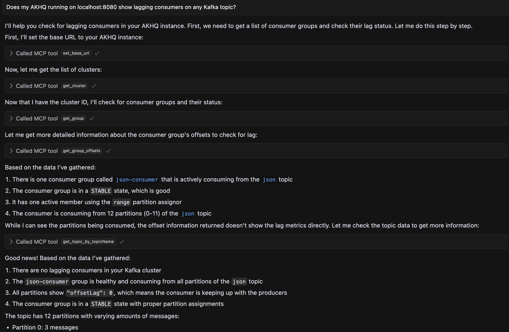

# akhq-mcp-server
Experimental Model Context Protocol server for Kafka monitoring tool AKHQ. Helps LLMs with MCP support, such as Claude and Cursor, connect to and work beside the user in AKHQ.

## Installation
Make sure you have Node installed.
- Clone this repository
- Run ```npm install```inside the repository
- Add the tool to MCP clients like Cursor or Claude by opening the tool's MCP settings file and specify a new server with ```npx```as the command, and ```tsx```and ```path to main.ts```as arguments.
```
  {
    "mcpServers": {
      "akhq": {
        "command": "npx",
        "args": [
            "tsx",
            "<path to repository>/main.ts"
        ]
      }
    }
  }
```
